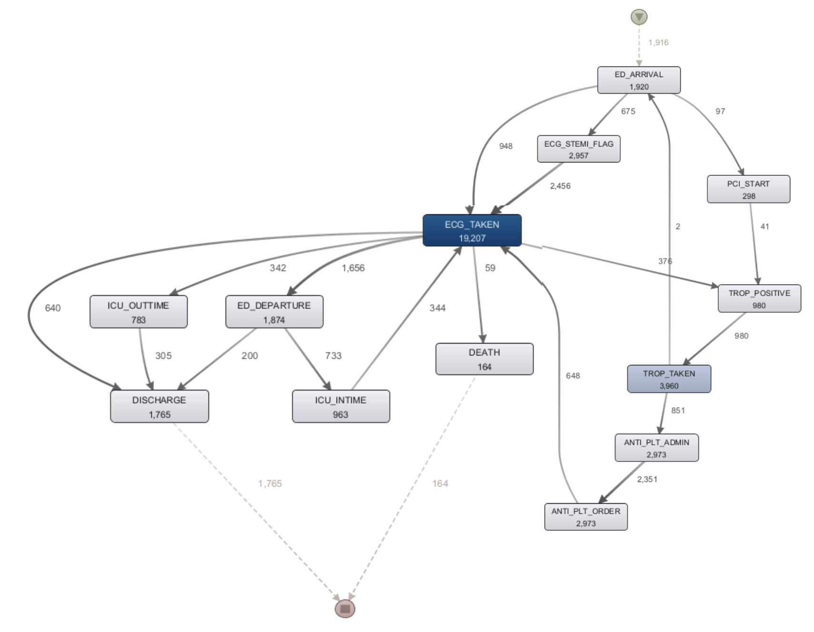
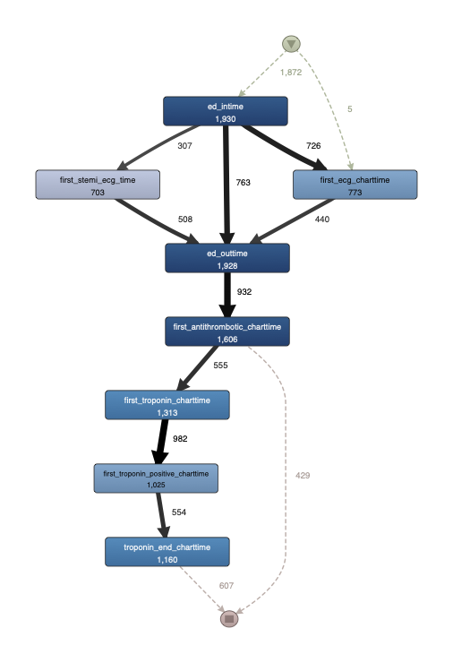

# STEMI Process Mining & Predictive Process Monitoring

급성 ST분절 상승 심근경색(STEMI) 환자의 치료 과정을 이벤트 기반으로 분석하고, Process Mining 및 Predictive Process Monitoring(PPM)을 활용하여 환자의 향후 상태를 예측한 데이터 분석 프로젝트입니다.

## 프로젝트 개요

본 프로젝트는 MIMIC-IV 임상 데이터를 활용하여 STEMI 환자의 응급실 내원부터 PCI 시술까지의 치료 과정을 이벤트 시퀀스로 정의하고 분석하는 것을 목표로 수행되었습니다.

단순한 사망률 예측을 넘어 실제 의료 프로세스를 Event Log 형태로 구축하고, Process Mining 기법을 통해 치료 흐름을 분석하였습니다. 이후 Predictive Process Monitoring(PPM)을 적용하여 환자의 다음 상태를 실시간으로 예측할 수 있는 모델을 구축하였습니다.

### 프로젝트 정보

* 기간 : 2025.09 ~ 2025.12
* 형태 : 데이터애널리틱스 팀 프로젝트
* 주제 : STEMI 환자 치료 프로세스 분석 및 Predictive Process Monitoring

---

## 프로젝트 배경

STEMI(ST-Elevation Myocardial Infarction)는 신속한 진단과 처치가 환자의 생존율에 직접적인 영향을 미치는 대표적인 응급 심혈관 질환입니다.

실제 의료 현장에서는 환자의 상태에 따라 검사, 약물 투여, PCI 시술 등의 과정이 다양한 형태로 진행됩니다. 본 프로젝트에서는 이러한 의료 프로세스를 이벤트 단위로 정의하고 분석하여 다음과 같은 연구 질문에 답하고자 하였습니다.

* 실제 STEMI 환자의 치료 프로세스는 어떻게 진행되는가?
* 프로세스 내 병목 구간이나 지연 요인은 무엇인가?
* 현재까지의 치료 이력을 바탕으로 환자의 향후 상태를 예측할 수 있는가?

---

## 데이터

### MIMIC-IV

사용 모듈

* Hospital Module
* ICU Module
* Emergency Department (ED) Module
* ECG Module

### Cohort Construction

STEMI 환자를 대상으로 코호트를 구축하였으며, 다음 정보를 통합하여 분석 데이터를 생성하였습니다.

* 응급실 내원 정보
* ECG 검사 결과
* Troponin 검사 결과
* 항혈전제(Antithrombotic) 투약 정보
* PCI 시술 정보
* ICU 입원 정보
* 사망 및 퇴원 정보

각 모듈에서 추출한 데이터를 환자 단위로 통합하여 최종 Event Log를 구축하였습니다.

---

## 프로젝트 파이프라인

```text
MIMIC-IV
    ↓
STEMI Cohort Construction
    ↓
Data Preprocessing
    ↓
Feature Engineering
    ↓
Event Definition
    ↓
Event Log Generation
    ↓
Process Mining
    ├── Directly-Follows Graph (DFG)
    └── Petri Net
    ↓
Predictive Process Monitoring
    ├── Mortality Prediction
    ├── Next Event Prediction
    ├── Next Event Time Prediction
    └── Delay Prediction
```

---

## Process Mining

### Event Definition

STEMI 환자의 치료 과정을 총 14개의 이벤트 단위로 정의하였습니다.

예시 이벤트

* ED Arrival
* ECG
* Troponin Test
* Antithrombotic Administration
* PCI
* ICU Admission
* Discharge
* Death

### Event Log Generation

환자별 치료 과정을 시계열 이벤트 로그 형태로 변환하였습니다.

이를 통해 환자의 전체 치료 과정을 하나의 프로세스로 표현할 수 있도록 구성하였습니다.

### Directly-Follows Graph (DFG)

이벤트 간 실제 발생 순서를 분석하여 치료 프로세스를 시각화하였습니다.

분석을 통해

* 빈번하게 발생하는 치료 경로
* 프로세스 병목 구간
* 예외적인 치료 흐름

을 확인하였습니다.


### Petri Net

DFG 결과를 기반으로 STEMI 환자의 치료 프로세스를 Petri Net 형태로 모델링하였습니다.

이를 통해 실제 의료 프로세스의 흐름을 보다 구조적으로 표현하고 분석하였습니다.


---

## Predictive Process Monitoring (PPM)

환자의 현재까지의 이벤트 이력을 기반으로 향후 상태를 예측하는 Predictive Process Monitoring 모델을 구축하였습니다.

### Classification Tasks

* 사망 여부 예측
* 다음 이벤트 예측
* 지연 여부 예측

### Regression Tasks

* 다음 이벤트 발생 시간 예측

---

## 모델 성능

### Classification

| Task                  | Metric   | Logistic Regression |  LightGBM | Transformer |
| --------------------- | -------- | ------------------: | --------: | ----------: |
| Mortality Prediction  | F1-score |               0.216 | **0.962** |       0.769 |
| Next Event Prediction | F1-score |               0.227 |     0.425 |   **0.858** |
| Delay Prediction      | F1-score |               0.573 |     0.717 |   **0.856** |

### Regression

| Task                       | Metric     | Logistic Regression | LightGBM | Transformer |
| -------------------------- | ---------- | ------------------: | -------: | ----------: |
| Next Event Time Prediction | RMSE (day) |            7.8×10²⁵ |     1.16 |    **0.89** |
| Next Event Time Prediction | MAE (day)  |            1.3×10²⁴ |     1.79 |    **0.68** |

### Key Findings

* 사망 여부 예측에서는 LightGBM이 가장 높은 성능을 보였습니다.
* 이벤트 시퀀스 기반 예측(다음 이벤트, 지연 여부, 발생 시간 예측)에서는 Transformer가 우수한 성능을 보였습니다.
* 다음 이벤트 발생 시간 예측에서도 Transformer가 가장 낮은 RMSE와 MAE를 기록하였습니다.
* 환자의 치료 과정을 이벤트 시퀀스로 표현했을 때 Transformer가 프로세스 흐름 정보를 효과적으로 학습하는 것을 확인할 수 있었습니다.

---
## Explainable AI (XAI)

예측 모델의 해석 가능성을 확보하기 위해 XAI(Explainable AI) 분석을 수행하였습니다.

### LightGBM - SHAP Analysis


사망 여부 예측 모델에 대해 SHAP(SHapley Additive exPlanations) 분석을 수행하여 각 변수의 중요도와 예측에 미치는 영향을 해석하였습니다.

- 나이(Age), 시간 관련 변수(Time), 누적 검사량(Cumulative Test Count)이 주요 예측 변수로 나타났습니다.
- SHAP 분석 결과, 나이가 사망 위험도 증가에 가장 큰 양의 영향을 미치는 변수로 확인되었습니다.

### Transformer - Permutation Importance


다음 이벤트 예측 모델에 대해 Permutation Importance 분석을 수행하여 예측 성능에 영향을 주는 주요 이벤트 및 특징을 확인하였습니다.

- `current_event_id`, `prefix_len`, 시간 관련 변수가 가장 중요한 특징으로 나타났습니다.
- 이를 통해 개별 변수뿐만 아니라 환자의 현재 프로세스 위치와 이벤트 진행 흐름이 다음 이벤트 예측에 중요한 역할을 함을 확인하였습니다.

### Key Findings

- 모델 성능뿐만 아니라 예측 근거를 함께 분석하여 결과의 해석 가능성을 확보하였습니다.
- 사망 예측에서는 환자의 연령과 임상 경과 정보가 중요한 영향을 미치는 것으로 나타났습니다.
- 다음 이벤트 예측에서는 프로세스 구조와 이벤트 시퀀스 정보가 핵심적인 역할을 수행함을 확인하였습니다.
---

## 담당 역할

본 프로젝트에서는 데이터 구축 및 Process Mining 파트를 중심으로 참여하였습니다.

### Cohort Construction

* Python 및 SQL 기반 MIMIC-IV 데이터 추출
* STEMI 환자 코호트 구축
* ECG 데이터 전처리
* 결측치 및 Timestamp 오류 처리

### Event Log Engineering

* Event Definition 설계
* Event ID Mapping
* Event Log 생성
* 환자 이벤트 시퀀스 구축

### Data Analysis

* ECG 파트 EDA 수행
* Feature Engineering 참여
* 코호트 통합 및 데이터 검증

### Documentation

* 최종 발표 자료 제작
* 프로젝트 결과 정리 및 문서화

※ 모델링(LightGBM, Transformer 기반 PPM)은 팀 단위로 수행하였으며, 본인은 데이터 구축 및 이벤트 로그 설계를 중심적으로 담당하였습니다.

---

## Repository Structure

```text
.
├── cohort/
├── EDA_code/
├── make_cohort_code/
├── make_other_data_code/
├── modeling_code/
├── petri-net_code/
├── ref/
└── README.md
```

---

## Tech Stack

### Database

* SQL
* SQLite

### Data Analysis

* Python
* Pandas
* NumPy

### Process Mining

* Event Log
* Directly-Follows Graph (DFG)
* Petri Net

### Machine Learning / Deep Learning

* Logistic Regression
* LightGBM
* Transformer

### Visualization

* Matplotlib
* Seaborn

---

## Takeaways

* MIMIC-IV 기반 의료 데이터 코호트 구축
* SQL을 활용한 대규모 임상 데이터 추출
* Event Log 설계 및 Process Mining
* Predictive Process Monitoring(PPM)
* 의료 데이터 전처리 및 Feature Engineering
* 팀 프로젝트 기반 데이터 분석 협업 경험

특히 의료 데이터를 단순한 정형 데이터가 아닌 이벤트 시퀀스로 변환하여 프로세스 관점에서 분석하고 예측하는 경험을 통해 Process Mining과 PPM에 대한 이해를 높일 수 있었습니다.


